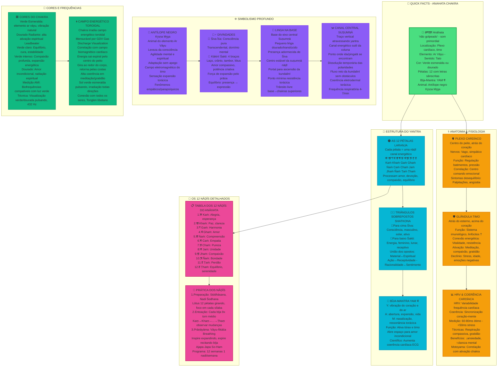

# 🌸 Anahata - Canvas Interativo

> **Canvas com Mermaid | Versões Interativas dos Mapas**  
> Diagramas navegáveis e responsivos do sistema energético do Anahata

---

## 🗺️ Mapa Completo do Anahata - Sistema Integrado



---

## 🏥 Práticas Detalhadas & Protocolos Clínicos

```mermaid
graph TB
    subgraph "🧘 ĀSANAS ESPECÍFICOS"
        A[🐪 Uṣṭrāsana - Camelo<br/>🌉 Setu Bandhasana - Ponte<br/>🐱 Marjaryāsana - Gato<br/>🐍 Bhujaṅgāsana - Cobra<br/>🐟 Matsyāsana - Peixe<br/>Foco: Abertura torácica, expansão peito<br/>flexibilidade coluna, ativação timo]
        
        B[🌬️ PRĀṆĀYĀMA YAM<br/>YAM Breathing Principal:<br/>• Inspire profundo pelo nariz<br/>• Expire prolongado: YĀĀĀMmmmm<br/>• Vibração concentrada no peito<br/>• Mínimo 21 repetições<br/>Complementares: Anuloma Viloma<br/>Ujjāyī respiração vitoriosa, Bhrāmarī abelha]
        
        C[🤲 MUDRĀS DO CORAÇÃO<br/>• Anjali Mudrā: Palmas unidas no peito<br/>• Hṛdaya Mudrā: Dedos específicos coração<br/>• Gaṇeśa Mudrā: Remoção obstáculos<br/>• Padma Mudrā: Lótus da compaixão<br/>Tempo: 5-15 min por mudrā<br/>Respiração: Consciente e profunda]
    end
    
    subgraph "📅 PROTOCOLOS SISTEMÁTICOS"
        D[📅 ROTINA 7 SEMANAS<br/>Semana 1-2: Respiração YAM diária<br/>Semana 3-4: Āsanas abertura torácica<br/>Semana 5-6: Meditação compaixão<br/>Semana 7: Integração total<br/>Diário: Manhã 20min prática<br/>Tarde 5min YAM, Noite gratidão/perdão]
        
        E[🆘 PROTOCOLO SOS<br/>Para crises emocionais:<br/>1. Respiração 4-7-8 - 3x<br/>2. YAM mantra - 21x<br/>3. Mão no coração + afirmação<br/>4. Visualizar luz verde expandindo<br/>5. Gratidão por 3 coisas<br/>Tempo total: 5-10 minutos<br/>Uso: Ansiedade, mágoa, conflitos]
    end
    
    subgraph "🔬 EVIDÊNCIA CIENTÍFICA"
        F[📈 ESTUDOS HRV<br/>HeartMath Institute:<br/>• Coerência cardíaca em meditação<br/>• ↓23% cortisol, ↑DHEA<br/>• Melhora tomada decisão<br/>Motoyama Research:<br/>• AMI detecta ativação chakra<br/>• Correlação ECG + estados meditativos<br/>• Picos 0,1–1 μA durante YAM]
        
        G[🧠 NEUROCIÊNCIA<br/>fMRI Studies:<br/>• Ativação córtex pré-frontal<br/>• ↑Matéria cinzenta compaixão<br/>• Neuroplasticidade emocional<br/>Descobertas:<br/>• 8 semanas meditação = mudanças cerebrais<br/>• Correlação timo-sistema nervoso confirmada<br/>• Ativação simultânea córtex + timo]
    end
    
    subgraph "💚 NUTRIÇÃO & LIFESTYLE"
        H[🥬 DIETA PARA O CORAÇÃO<br/>Alimentos verdes:<br/>• Espinafre, couve, brócolis<br/>• Abacate, pesto, chás verdes<br/>• Maçã verde, kiwi, limão<br/>Evitar: Processados, excesso sal<br/>álcool, cafeína em excesso<br/>açúcares refinados]
        
        I[💚 LIFESTYLE CORAÇÃO<br/>Atividades:<br/>• Caminhadas na natureza<br/>• Dança livre, canto, música<br/>• Voluntariado, terapia abraço<br/>Ambiente:<br/>• Plantas, flores, cor verde<br/>• Cristais, aromas: rosa, eucalipto<br/>• Espaços harmoniosos, luz natural]
    end
    
    subgraph "⚠️ RISCOS & ÉTICA"
        J[⚠️ PRECAUÇÕES<br/>Riscos:<br/>• Sobrecarga emocional<br/>• Dependência afetiva<br/>• Perda de limites<br/>• Exaustão empática<br/>Contraindicações:<br/>• Cardiopatias graves<br/>• Psicoses ativas<br/>• Trauma recente não tratado]
        
        K[🎯 ÉTICA DA PRÁTICA<br/>Princípios:<br/>• Respeitar limites pessoais<br/>• Não impor energia a outros<br/>• Confidencialidade absoluta<br/>• Autocuidado primeiro<br/>Conduta:<br/>• Prática regular, sem fanatismo<br/>• Buscar orientação qualificada<br/>• Integrar com vida cotidiana]
    end
    
    A --> D
    B --> E
    C --> D
    F --> G
    H --> I
    J --> K
    
    classDef praticas fill:#4ade80,stroke:#16a34a,stroke-width:3px
    classDef protocolos fill:#f59e0b,stroke:#d97706,stroke-width:2px
    classDef ciencia fill:#06b6d4,stroke:#0891b2,stroke-width:2px
    classDef lifestyle fill:#8b5cf6,stroke:#7c3aed,stroke-width:2px
    classDef etica fill:#ec4899,stroke:#be185d,stroke-width:2px
    
    class A,B,C praticas
    class D,E protocolos
    class F,G ciencia
    class H,I lifestyle
    class J,K etica
```



---

## 📚 Relatos Históricos & Visões Clarividentes

```mermaid
graph TB
    subgraph "👁️ VISÃO CLARIVIDENTE - LEADBEATER"
        A[👁️ DESCRIÇÃO LEADBEATER<br/>Visão Clarividente Detalhada:<br/>• 12 pétalas douradas irradiantes<br/>• Irradiação verde-rosa intensa<br/>• Triângulos interpenetrados luminosos<br/>• Campo toroidal expandido visível<br/>Durante ativação:<br/>• Luz intensa no peito expandindo<br/>• Conexão energética com outros seres<br/>• Aura cardíaca dourada expandida<br/>• Consciência arquetípica ativada]
    end
    
    subgraph "🔬 MEDIÇÕES CIENTÍFICAS - MOTOYAMA"
        B[🔬 RESULTADOS MOTOYAMA<br/>Medições AMI (1970-2020):<br/>• Atividade elétrica detectável<br/>• Correlação com estados emocionais<br/>• Mudanças GSR durante YAM<br/>• Picos 0,1–1 μA no plexo cardíaco<br/>Resultados:<br/>• Comprovação científica reprodutível<br/>• Correlação fisiológica confirmada<br/>• Aparelhos podem detectar ativação<br/>• Validação instrumental de chakras]
    end
    
    subgraph "📜 COMPARATIVO SISTEMAS"
        C[📜 LEADBEATER x MOTOYAMA x SWĀSTHYA<br/>Pétalas/Letras:<br/>• Leadbeater: 12 pétalas, vibrações emocionais<br/>• Motoyama: Atividade nāḍīs, correspondência mental<br/>• SwāSthya: Padrões comportamentais específicos<br/>Triângulos:<br/>• Leadbeater: Śiva/Śakti magnetismo sutil<br/>• Motoyama: União ida/pingalā na suṣumṇā<br/>• SwāSthya: Polaridades da consciência<br/>Som YAM:<br/>• Leadbeater: Vibração iniciadora compaixão<br/>• Motoyama: HRV e ondas cerebrais mensuráveis<br/>• SwāSthya: Sons sem fricção, autotranscendência]
    end
    
    A --> B
    B --> C
    
    classDef clarividente fill:#8b5cf6,stroke:#7c3aed,stroke-width:3px
    classDef cientifico fill:#06b6d4,stroke:#0891b2,stroke-width:2px
    classDef comparativo fill:#f59e0b,stroke:#d97706,stroke-width:2px
    
    class A clarividente
    class B cientifico
    class C comparativo
```

---

## ✅ Checklist Completo de Ativação & Indicadores

```mermaid
graph TB
    subgraph "🟢 SINAIS FÍSICOS DE ATIVAÇÃO"
        D[💓 INDICADORES FÍSICOS<br/>✅ Calor/expansão no centro do peito<br/>✅ Respiração mais profunda natural<br/>✅ HRV melhorado (60-80ms)<br/>✅ Postura ereta espontânea<br/>✅ Sensação leveza torácica<br/>✅ Pulsação sutil no timo<br/>✅ Maior resistência a doenças<br/>✅ Circulação melhorada mãos/pés]
    end
    
    subgraph "🟢 SINAIS EMOCIONAIS"
        E[💖 INDICADORES EMOCIONAIS<br/>✅ ↑Empatia espontânea natural<br/>✅ Perdão mais fácil, sem esforço<br/>✅ Compaixão por si e outros<br/>✅ Equilíbrio emocional em conflitos<br/>✅ Amor incondicional emergindo<br/>✅ Redução julgamentos automáticos<br/>✅ Aceitação das imperfeições<br/>✅ Generosidade natural aumentada]
    end
    
    subgraph "🟢 SINAIS ENERGÉTICOS"
        F[⚡ INDICADORES ENERGÉTICOS<br/>✅ Sensação conexão universal<br/>✅ Percepção de campos sutis<br/>✅ Anāhata nāda (som interno)<br/>✅ Sincronicidades aumentadas<br/>✅ Intuição cardíaca aguçada<br/>✅ Capacidade irradiação energética<br/>✅ Percepção aura outras pessoas<br/>✅ Canalização energia cura]
    end
    
    subgraph "🟢 SINAIS COMPORTAMENTAIS"
        G[🤝 INDICADORES COMPORTAMENTAIS<br/>✅ Atos bondade naturais, espontâneos<br/>✅ Comunicação não-violenta<br/>✅ Atração por natureza, verde<br/>✅ Relacionamentos harmoniosos<br/>✅ Resolução conflitos pacífica<br/>✅ Cuidado animais/plantas<br/>✅ Atividades voluntariado<br/>✅ Prática gratidão diária]
    end
    
    subgraph "🔴 SINAIS DE ALERTA"
        H[⚠️ ATENÇÃO - POSSÍVEL DESEQUILÍBRIO<br/>🔴 Hipersensibilidade extrema<br/>🔴 Dor persistente no peito<br/>🔴 Palpitações sem causa médica<br/>🔴 Dependência emocional excessiva<br/>🔴 Perda total de limites pessoais<br/>🔴 Exaustão empática constante<br/>🔴 Invasão energética outros<br/>🔴 Messianismo, ego espiritual]
    end
    
    subgraph "🧘 PRÁTICAS ESSENCIAIS CHECKLIST"
        I[✅ CHECKLIST DE ATIVAÇÃO SIMBÓLICA<br/>☐ Meditação foco yantra completo<br/>☐ Recitação YAM (21x mínimo diário)<br/>☐ Visualização antílope dourado livre<br/>☐ Contemplação Shatkona união opostos<br/>☐ Canalização energia Kākinī compaixão<br/>☐ Respiração expansiva Vāyu tórax<br/>☐ Conduta ética: empatia, equilíbrio, desapego<br/>☐ Integração prática vida cotidiana]
    end
    
    D --> E
    E --> F
    F --> G
    G --> H
    I --> D
    
    classDef positivo fill:#10b981,stroke:#059669,stroke-width:3px
    classDef alerta fill:#ef4444,stroke:#dc2626,stroke-width:3px
    classDef praticas fill:#4ade80,stroke:#16a34a,stroke-width:2px
    
    class D,E,F,G positivo
    class H alerta
    class I praticas
```

---

## 💚 Estados e Qualidades do Anahata

```mermaid
graph TD
    A[💚 Anahata Equilibrado] --> B[Qualidades Positivas]
    A --> C[Sinais Físicos]
    A --> D[Estados Mentais]
    A --> E[Capacidades Energéticas]
    
    B --> F[💕 Amor Incondicional]
    B --> G[🕊️ Compaixão]
    B --> H[☮️ Perdão]
    B --> I[🤝 Empatia]
    B --> J[✨ Aceitação]
    
    C --> K[💓 Coração Saudável]
    C --> L[🫁 Respiração Profunda]
    C --> M[🤗 Postura Aberta]
    C --> N[✋ Tato Sensível]
    C --> O[💪 Timo Ativo]
    
    D --> P[😌 Serenidade]
    D --> Q[🧘 Paz Interior]
    D --> R[😊 Alegria Natural]
    D --> S[🌟 Autoestima Saudável]
    D --> T[🤲 Generosidade]
    
    E --> U[🔄 Irradiação Energética]
    E --> V[🌈 Percepção Sutil]
    E --> W[⚖️ Equilíbrio Emocional]
    E --> X[🔗 Conexão Universal]
    E --> Y[🎭 Cura Emocional]
    
    classDef centro fill:#4ade80,stroke:#16a34a,stroke-width:4px
    classDef categoria fill:#06b6d4,stroke:#0891b2,stroke-width:3px
    classDef qualidade fill:#f59e0b,stroke:#d97706,stroke-width:2px
    classDef fisico fill:#ec4899,stroke:#be185d,stroke-width:2px
    classDef mental fill:#8b5cf6,stroke:#7c3aed,stroke-width:2px
    classDef energetico fill:#10b981,stroke:#059669,stroke-width:2px
    
    class A centro
    class B,C,D,E categoria
    class F,G,H,I,J qualidade
    class K,L,M,N,O fisico
    class P,Q,R,S,T mental
    class U,V,W,X,Y energetico
```



---

## 🌟 INTEGRAÇÃO FINAL - Síntese Completa

```mermaid
graph TB
    subgraph "🌟 CONCLUSÃO INTEGRATIVA"
        A[🌟 INTEGRAÇÃO FINAL<br/>O Anāhata é o único chakra com capacidade de<br/>irradiar luz para todos os lados.<br/>Não se trata apenas de amar —<br/>trata-se de se tornar amor.<br/>— SwāSthya<br/><br/>🔑 Síntese Prática:<br/>1. Respiração YAM diária mínimo 21x<br/>2. Āsanas abertura torácica 15-20 min<br/>3. Meditação compassiva 10-15 min<br/>4. HRV tracking como métrica objetiva<br/>5. Conduta ética em relacionamentos]
    end
    
    subgraph "🎯 META TRANSFORMATIVA"
        B[🎯 META FINAL<br/>Transformar o coração em portal de<br/>cura e compaixão para si mesmo e o mundo<br/><br/>💚 Mantra de Integração:<br/>Meu coração é fonte inesgotável de<br/>amor e sabedoria. Irradio paz e<br/>compaixão a todos os seres.<br/><br/>🕉️ Que todos os seres sejam<br/>felizes e livres de sofrimento 🕉️]
    end
    
    subgraph "🌳 KALPAVṚKṢA - ÁRVORE DOS DESEJOS"
        C[🌳 KALPAVṚKṢA NO CORAÇÃO<br/>Conceito: Árvore dos desejos no coração<br/>Significado: Manifestação através do amor<br/>Prática: Visualizar árvore dourada no peito<br/><br/>Técnica:<br/>1. Meditar no centro cardíaco<br/>2. Ver árvore crescendo luminosa<br/>3. Intenções puras como frutos dourados<br/>4. Gratidão pela realização universal<br/><br/>Energia: Manifestação compassiva<br/>Resultado: Desejos alinhados com dharma]
    end
    
    subgraph "💖 EMPATIA & COMPAIXÃO DESENVOLVIDAS"
        D[💖 EMPATIA & COMPAIXÃO<br/>Empatia: Capacidade de sentir o outro<br/>Compaixão: Ação amorosa dirigida<br/><br/>Desenvolvimento:<br/>• Meditação loving-kindness diária<br/>• Tonglen dar e receber sofrimento<br/>• Visualização universal todos seres<br/>• Perdão ativo e consciente<br/><br/>Sinais: Sensibilidade aumentada,<br/>conexão profunda, irradiação natural<br/>Resultado: Coração como portal cura]
    end
    
    A --> B
    B --> C
    C --> D
    
    classDef integracao fill:#4ade80,stroke:#16a34a,stroke-width:4px
    classDef meta fill:#f59e0b,stroke:#d97706,stroke-width:3px
    classDef manifestacao fill:#8b5cf6,stroke:#7c3aed,stroke-width:2px
    classDef compaixao fill:#ec4899,stroke:#be185d,stroke-width:2px
    
    class A integracao
    class B meta
    class C manifestacao
    class D compaixao
```



---

## 🔧 Ferramentas Interativas

### 📊 Medição de Progresso
Use esta tabela para acompanhar sua prática:

| Prática | Frequência | Duração | Observações |
|---------|------------|---------|-------------|
| YAM Mantra | Diária | 21 repetições | Sensações no peito |
| Meditação Anahata | 3x/semana | 15 min | Visualização da cor |
| Pranayama YAM | Diária | 5 min | Qualidade da respiração |
| Asanas do Coração | Diária | 10 min | Abertura torácica |

### 🎯 Links Rápidos
- [[00 - INBOX/Anahata/Anahata Chakra\|Anahata Chakra]] - Teoria completa
- [[00 - INBOX/Anahata/Anahata - Visualizações Interativas\|Anahata - Visualizações Interativas]] - Imagens com zoom
- [[Pranayama\|Pranayama]] - Técnicas de respiração
- [[Mudras\|Mudras]] - Gestos sagrados

---

## 🎮 Como Usar os Diagramas

1. **📱 Responsivos**: Os diagramas se adaptam ao seu dispositivo
2. **🔍 Interativos**: Elementos clicáveis (em alguns navegadores)
3. **🎨 Visuais**: Cores representam diferentes categorias
4. **🧭 Navegáveis**: Siga as setas para entender as conexões

---

*Estes diagramas são versões interativas dos Canvas originais, otimizadas para o Digital Garden e compatíveis com todos os dispositivos.* 