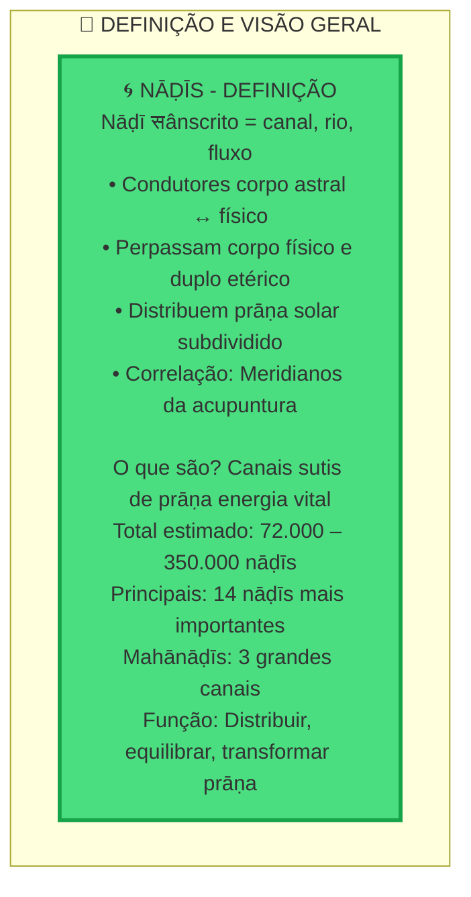
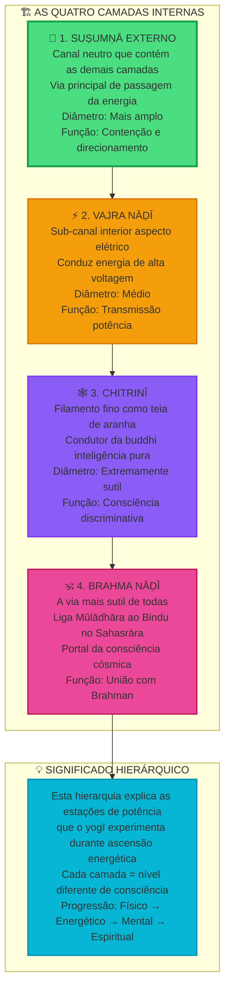
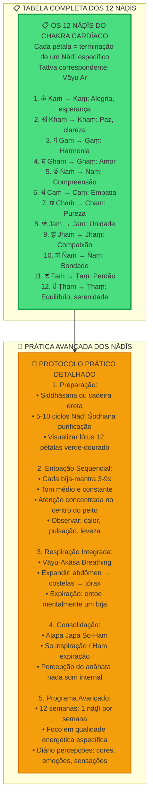
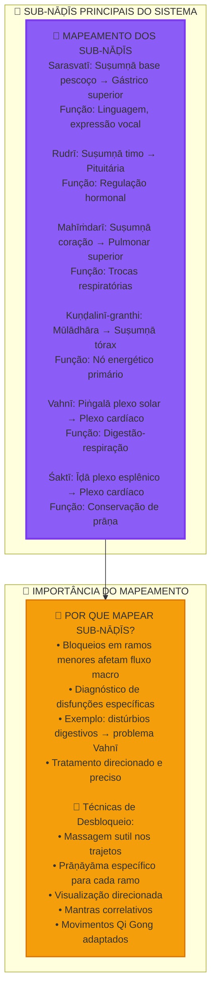
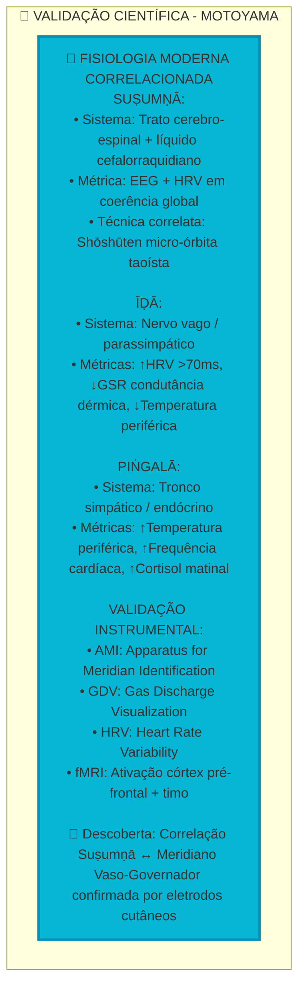

---
{"dg-publish":true,"permalink":"/00 - INBOX/Anahata/Sistema Nadis - Completo Interativo/","title":"Sistema Nāḍīs - Completo Interativo","tags":["source/yoga-tratado","type/interactive","type/system","type/nadis","theme/yoga/energy/nadis","theme/yoga/energy/sushumna","theme/yoga/energy/ida-pingala"],"noteIcon":""}
---

# 🌀 Sistema Nāḍīs - Canais Energéticos Completos

> **Sistema Completo dos Canais Energéticos | Mapeamento Científico e Tradicional**  
> Exploração detalhada dos 72.000+ nāḍīs, com foco nos Mahānāḍīs e sistema do Anāhata

---

## 🌀 QUICK FACTS - Sistema Nāḍīs

---

## 🔵 OS TRÊS MAHĀNĀḌĪS - Sistema Principal

```mermaid
graph TB
    subgraph "🔵 SUṢUMṆĀ - CANAL NEUTRO CENTRAL"
        A[🔵 SUṢUMṆĀ - Via da Kuṇḍalinī<br/>Trajeto: Mūlādhāra → Sahasrāra linha reta<br/>Localização: Dentro da coluna vertebral<br/>Função: Via real da Kuṇḍalinī, integra demais nāḍīs<br/>Correlação Científica:<br/>• Canal medular + líquido cefalorraquidiano<br/>• Meridiano Vaso-Governador VG<br/>• Trato cerebro-espinal<br/>Características: Conduz força evolutiva<br/>Estado: Neutro, equilibrado, transcendental]
    end

    subgraph "🌙 ĪḌĀ - CANAL LUNAR YIN"
        B[🌙 ĪḌĀ - Nāḍī Lunar Receptivo<br/>Trajeto: Esquerda do Suṣumṇā, espiral ascendente<br/>Término: Narina esquerda<br/>Polaridade: Lunar, frio, receptivo, mental<br/>Correlação Científica:<br/>• Tronco simpático esquerdo<br/>• 1ª linha meridiano Bexiga<br/>• Nervo vago / parassimpático<br/>Funções: Regula mente, psique, relaxamento<br/>Métrica: Elevação HRV, queda GSR<br/>Características: Contemplativo, introspectivo]
    end

    subgraph "☀️ PIṄGALĀ - CANAL SOLAR YANG"
        C[☀️ PIṄGALĀ - Nāḍī Solar Ativo<br/>Trajeto: Direita do Suṣumṇā, espiral ascendente<br/>Término: Narina direita<br/>Polaridade: Solar, quente, ativo, vital<br/>Correlação Científica:<br/>• Tronco simpático direito<br/>• 3ª linha meridiano Bexiga<br/>• Sistema endócrino ativação<br/>Funções: Metabolismo, calor, vitalidade física<br/>Métrica: ↑temperatura, ↑frequência cardíaca<br/>Características: Dinâmico, expressivo, ativo]
    end

    subgraph "⚕️ SIMBOLISMO DO CADUCEU"
        D[⚕️ CADUCEU DE MERCÚRIO<br/>Visão Leadbeater: Duas serpentes enroscadas<br/>🔴 Serpente Vermelha = Īḍā Lua<br/>🟡 Serpente Amarela = Piṅgalā Sol<br/>🔵 Linha Azul Intensa = Suṣumṇā pós-iniciação<br/>Origem: Caduceu de Mercúrio antigo<br/>Significado: Equilíbrio das polaridades<br/>Meta: Fusão no Ājñā, abertura Brahma-Randhra<br/>Resultado: Transcendência dualidade]
    end

    A --> B
    B --> C
    C --> D

    classDef sushumna fill:#4ade80,stroke:#16a34a,stroke-width:3px
    classDef ida fill:#06b6d4,stroke:#0891b2,stroke-width:2px
    classDef pingala fill:#f59e0b,stroke:#d97706,stroke-width:2px
    classDef simbolismo fill:#8b5cf6,stroke:#7c3aed,stroke-width:2px

    class A sushumna
    class B ida
    class C pingala
    class D simbolismo
```

---

## 🏗️ ESTRATIGRAFIA DA SUṢUMṆĀ - Quatro Camadas

---

## 🌸 OS 12 NĀḌĪS DO ANĀHATA - Sistema Cardíaco

---

## 🌿 SUB-NĀḌĪS E RAMIFICAÇÕES

---

## 🔬 CORRELAÇÕES CIENTÍFICAS MODERNAS

---

## ⚕️ DIAGNÓSTICO E CORREÇÃO DE DISTÚRBIOS

```mermaid
graph TB
    subgraph "⚕️ TABELA DIAGNÓSTICA COMPLETA"
        A[⚕️ SINTOMAS E CORREÇÕES<br/>Taquicardia, insônia → Piṅgalā hiperativa<br/>Correção: Sītālī + Bhrāmarī<br/><br/>Depressão, apatia → Īḍā hipoativa<br/>Correção: Kapālabhātī + Ujjāyī<br/><br/>Falta empatia, isolamento → Bloqueio Anāhata<br/>Correção: Anjali Mudrā + Tonglen<br/><br/>Dores crônicas no peito → Granthi torácico<br/>Correção: Mūla-bandha + prāṇāyāma lento<br/><br/>Falta concentração → Desequilíbrio serpentes<br/>Correção: Nāḍī Śodhana 1:2<br/><br/>Ansiedade, agitação → Suṣumṇā bloqueada<br/>Correção: Yoga Nidra + visualização<br/><br/>Fadiga crônica → Sub-nāḍīs obstruídos<br/>Correção: Massagem + prāṇāyāma específico]
    end

    subgraph "🩺 SINAIS DE DIAGNÓSTICO"
        B[🩺 INDICADORES OBJETIVOS<br/>• HRV < 50 ms → sobreativação simpática Piṅgalā<br/>• Respiração superficial → Īḍā bloqueada<br/>• Narinas não alternam → desequilíbrio geral<br/>• Dor/tensão na coluna → Suṣumṇā obstruída<br/>• GSR elevado persistente → stress crônico<br/>• Temperatura periférica irregular → desequilíbrio térmico<br/>• Dominância nasal fixa → estagnação energética]
    end

    subgraph "📋 EXEMPLO DE PROTOCOLO"
        C[📋 CASO: HRV < 50 ms<br/>Diagnóstico: Piṅgalā hiperativa<br/><br/>Intervenção Imediata:<br/>1. 5 min Sītālī<br/>   • Língua enrolada, inspiração refrescante<br/>   • Expiração pelo nariz<br/>2. 5 min Bhrāmarī<br/>   • Zumbido de abelha na expiração<br/>   • Acalma sistema nervoso<br/><br/>Monitoramento:<br/>• Meta: HRV 60-80 ms<br/>• Tempo: Verificar após 15 min<br/>• Indicador secundário: ↓GSR<br/><br/>Manutenção:<br/>• Manhã: Sītālī 10 min<br/>• Tarde: Bhrāmarī 5 min<br/>• Noite: Nāḍī Śodhana 2:1<br/><br/>Resultado Esperado:<br/>• Normalização HRV em 7-10 dias<br/>• Melhora qualidade sono<br/>• Redução ansiedade]
    end

    A --> B
    B --> C

    classDef diagnostico fill:#ec4899,stroke:#be185d,stroke-width:3px
    classDef sinais fill:#f59e0b,stroke:#d97706,stroke-width:2px
    classDef protocolo fill:#8b5cf6,stroke:#7c3aed,stroke-width:2px

    class A diagnostico
    class B sinais
    class C protocolo
```

---

## 🔧 Ferramentas Interativas

### 📊 Tabela de Monitoramento Pessoal

Use esta tabela para acompanhar seu progresso:

| Data | HRV (ms) | Narina Dominante | Prática Realizada | Duração | Observações |
| ---- | -------- | ---------------- | ----------------- | ------- | ----------- |
|      |          |                  |                   |         |             |
|      |          |                  |                   |         |             |
|      |          |                  |                   |         |             |

### 🎯 Links Rápidos do Sistema

- [[00 - INBOX/Anahata/Anahata Chakra\|Anahata Chakra]] - Chakra cardíaco principal
- [[Anahata - Canvas Interativo\|Anahata - Canvas Interativo]] - Diagramas completos
- [[Pranayama\|Pranayama]] - Técnicas respiratórias
- [[Mudras\|Mudras]] - Gestos energéticos
- [[Meditação\|Meditação]] - Práticas contemplativas

---

## 

## 💫 CONCLUSÃO INTEGRATIVA DO SISTEMA

> **"Sem o livre fluir pelos três grandes canais, o śakti não pode ascender e o yogī jamais atravessa o Portão de Brahman."** — H. Motoyama

> **"Quem domina Īḍā e Piṅgalā, vence as rodas do nascimento; quem faz a Suṣumṇā brilhar, atinge a luz do Nirvāṇa."** — SwāSthya Yôga

> **"O verdadeiro guru une tradição e ciência; quem domina isso, encontra a ponte entre mente e matéria."** — Adaptado de C. W. Leadbeater

## 🌟 SÍNTESE INTEGRATIVA FINAL

> **"Os Mahānāḍīs formam a auto-estrada da consciência: Īḍā e Piṅgalā são faixas laterais que cuidam dos fluxos mentais e vitais; o Suṣumṇā é a pista central onde passa a força evolutiva."** — SwāSthya Adaptado

**🔑 Pontos-Chave:**

1. **Mahānāḍīs** = eixo central da arquitetura energética
2. **Sub-nāḍīs** = especialização do fluxo em órgãos/chakras  
3. **Distúrbios** = manifestações clínicas corrigíveis
4. **Pesquisa moderna** = validação e aprimoramento de métodos milenares

**🎯 Meta Final:** Dirigir a própria energia rumo ao estado de Yoga — união plena

**🕉️ Que sua energia flua livre, limpa e luminosa! 🕉️**

---

*Este sistema representa a síntese completa do conhecimento tradicional e científico sobre os nāḍīs, oferecendo tanto base teórica quanto aplicação prática para o desenvolvimento energético.* 
